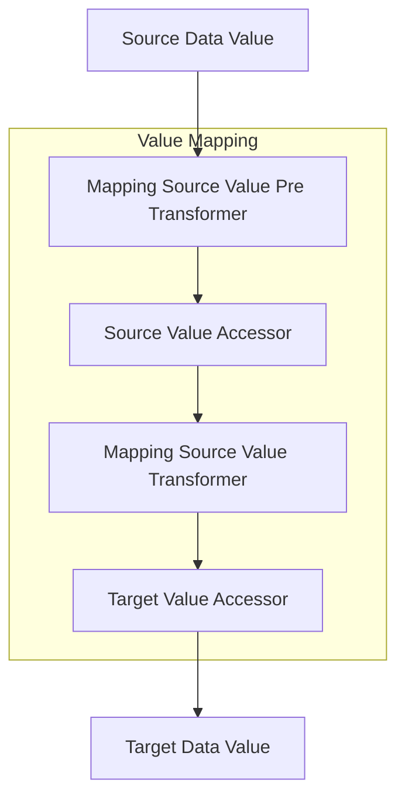
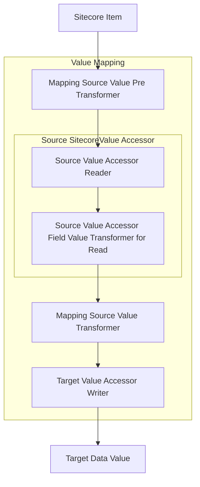
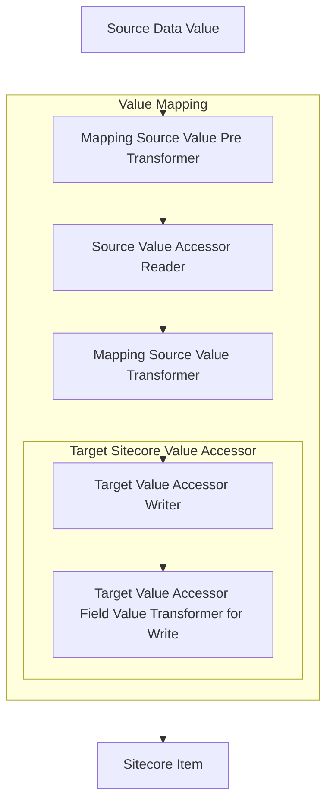

The [Sitecore Data Exchange Framework](https://doc.sitecore.com/developers/def/40/data-exchange-framework/en/data-exchange-framework.html) allows for data to be synchronized between two disparate systems, neither of which need to actually be Sitecore. The modeling for the data mapping is handled in the Sitecore content tree, however, the process can involve any two systems you configure.

When mapping fields, there is a certain process that a field goes through:



As you can see, there are several opportunities for you to be able to transform the data values through the mapping process. If you're writing a custom provider, one important thing is to recognize all the various data types that is going to flow through this process. For example, if my source data value is a date string (MM/dd/yyyy) and my target data value is another date string in a different format (yyyy-MM-dd), where does the parsing of the source date string happen into a `DateTime` object and where does the `ToString()` formatting happen to be written to the target date string? Does it even need to be converted into a C# object at all during the process? Or does the string just require some manipulation? These are considerations that will need to be taken when determining how to model your data transformation processes.

While this is the process that DEF provides you, since DEF is so extensible you have the option of adding even more steps for possible transformation in this pipeline. For example, the Sitecore provider value accessors provide additional fields for selecting [Value Readers](https://doc.sitecore.com/developers/def/40/data-exchange-framework/en/value-reader.html) to perform transformation after a Sitecore item is read as well as before data is written to a Sitecore item. That results in a process that looks something like this:

#### Sitecore as Source Data



#### Sitecore as Target Data



These extra fields provide more extension points to transform data in the pipeline that are directly associated with the [value accessors](https://doc.sitecore.com/developers/def/40/data-exchange-framework/en/value-accessor.html). Custom value accessors can take advantage of this as well - the converter will need to read in a `Droptree` field on the template and pass the corresponding `IValueReader` as a property upon instantiation of the reader or as a constructor parameter. A quick definitely-not-production-ready-code example of what this looks like:

```csharp
// SampleValueAccessorConverter.cs

[SupportedIds(SampleValueAccessorTemplateId)]
public class SampleValueAccessorConverter : ValueAccessorConverter
{
  public const string SampleValueAccessorTemplateId = "{0000000-0000-0000-0000-0000000000000}";
  public SampleValueAccessorConverter(IItemModelRepository repository) : base(repository)
    {
    }

  protected override IValueReader GetValueReader(ItemModel source)
    {
    // create a new instance of our value reader
    return new SampleValueReader
    {
      // pass in the item that's in the ReaderValueTransformer field (from your value accessor template)
      ValueTransformer = this.ConvertReferenceToModel(source, "ReaderValueTransformer");
    };
  }

  protected override IValueWriter GetValueWriter(ItemModel source)
    {
    // create a new instance of our value writer
    return new SampleValueWriter
    {
      // pass in the item that's in the WriterValueTransformer field (from your value accessor template)
      ValueTransformer = this.ConvertReferenceToModel(source, "WriterValueTransformer");
    };
  }
}
```

```csharp
// SampleValueReader.cs

public class SampleValueReader : IValueReader
{
  // property that is populated by the value accessor converter
  public IValueReader ValueTransformer { get; set; }

  public ReadResult Read(object source, DataAccessContext context)
    {
    var readResult = new ReadResult(DateTime.UtcNow)
    {
      WasValueRead = false
    };

    // do transformation operations
    var transformedValue = Transform(source);

    // set the transformed value as the value to return
    readResult.ReadValue = transformedValue;
    readResult.WasValueRead = true;

    return readResult;
  }
}
```

```csharp
// SampleValueWriter.cs

public class SampleValueWriter : IValueWriter
{
  // property that is populated by the value accessor converter
  public IValueReader ValueTransformer { get; set; }

  public virtual bool Write(object target, object value, DataAccessContext context)
    {
    // if we have a transformer defined, execute it
    if (this.ValueTransformer != null)
    {
      var readResult = this.ValueTransformer.Read(value, new DataAccessContext());
      // if the transform was successful, set the transformation result as the value instead
      value = readResult.WasValueRead ? readResult.ReadValue : value;
    }

    // do write operations
    WriteToSomething(value);

    return true;
  }
}
```
