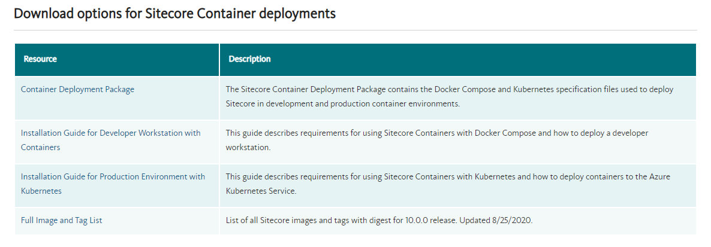

[Sitecore 10.0](https://dev.sitecore.net/Downloads/Sitecore_Experience_Platform/100/Sitecore_Experience_Platform_100.aspx) made its way into the world a few weeks back and while it wasn't a dramatic user-facing major release, it was a huge release for Sitecore becoming more cloud-native and looking ahead to the future of the Sitecore development experience.

## Cloud-Native?

You may be asking, what does "cloud-native" mean? Well, for that we can turn to the [Cloud Native Computing Foundation](https://www.cncf.io/) who defines "cloud-native" as the following:

> Cloud native technologies empower organizations to build and run scalable applications in modern, dynamic environments such as public, private, and hybrid clouds. Containers, service meshes, microservices, immutable infrastructure, and declarative APIs exemplify this approach.
>
> These techniques enable loosely coupled systems that are resilient, manageable, and observable. Combined with robust automation, they allow engineers to make high-impact changes frequently and predictably with minimal toil.
>
> <cite>-- https://github.com/cncf/toc/blob/master/DEFINITION.md</cite>

tl;dr - make your applications scalable

## Sitecore and Containers

Fortunately, the Sitecore architecture already encourages this with the scaling of content delivery servers. As a separate role altogether, they can be scaled independently and are inherently stateless on their own, maintaining the ability to have instances spun up and spun down at will.

In Sitecore 10, Sitecore brings the power of containers to the Sitecore platform. For a good primer of containers and containerization, you can see [this article from Docker](https://www.docker.com/resources/what-container). The wonderful Sitecore community had invested into creating container images for previous versions of Sitecore as an [open-source project](https://github.com/sitecore/docker-images), however, Sitecore is now providing container images through its own container registry for its platform as a first-class citizen for production deployments.

## What does this mean?

We can now use modern technologies like [Docker](https://www.docker.com/) and [Kubernetes](https://kubernetes.io/)! This is pretty exciting for both developers and operations alike. As a former Sitecore Cloud MVP, this is the direction I've been wanting the platform to head towards.

For developers, this means you can spin up a Sitecore environment completely in Docker - in fact, Sitecore provides `docker-compose.yml` files as part of its release. Remember how complex a local Sitecore installation could be with all of its various dependencies and such? Sitecore made it a little easier with the Sitecore Install Assistant, however, now with containers, you can have a fresh machine with nothing other than Docker installed and run `docker-compose up` and have a full-blown Sitecore environment running locally, including SQL Server and Solr. Amazing! This is also great for [the new Sitecore headless development experience](https://doc.sitecore.com/developers/100/developer-tools/en/sitecore-headless-development.html) as this would enable you to effectively run Sitecore as a service locally.

For ops people, this means you can use the power of Kubernetes with Sitecore! Sitecore also ships a number of K8s configuration files to spin up an instance in Kubernetes with [AKS](https://azure.microsoft.com/en-us/services/kubernetes-service/) or another cloud provider that supports Windows containers. I won't go into all the details about Kubernetes here, but it's a great bit of technology that helps orchestrate containers, networking, and security with a huge amount of industry backing and extensibility points. It's cool, trust me.

## How do I get started?

Sitecore has put together installation guides for Docker and Kubernetes on the Sitecore 10 download page. You'll find a `Container Deployment Package` which contains all the `docker-compose.yml` and Kubernetes config files for the various flavors of Sitecore. For your local dev environment, you'll want to ensure that Docker Desktop for Windows is installed before you get started. All the details are in the installation guides. Happy containering!

