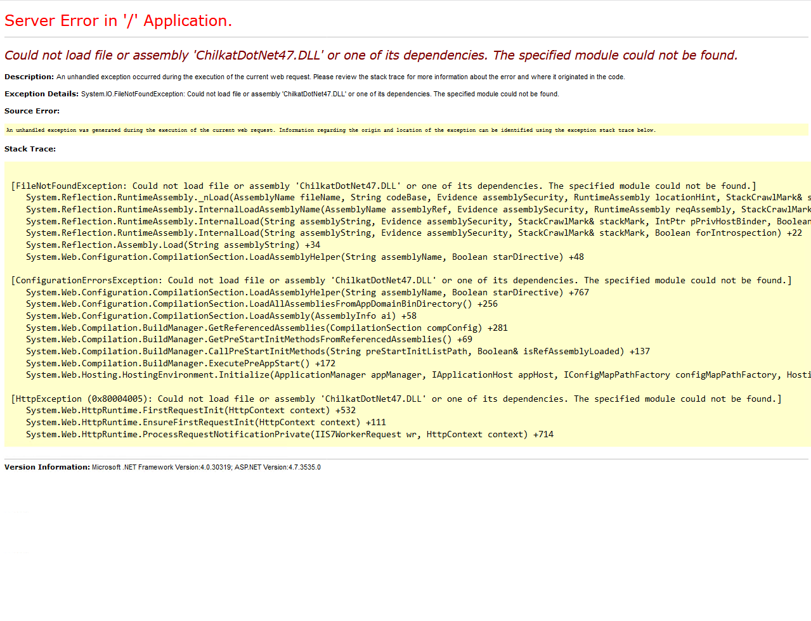

I'm pretty sure the rule is that if you went Googling for an issue and the link that you found the answer on was already purple, you have to blog about it for posterity.

So you just installed Sitecore 9 and after remembering to install IIS and ASP.NET 4.7, you fire up your site to get this wonderful screen.



For SEO purposes, here's the error message:

```

Server Error in '/' Application.
Could not load file or assembly 'ChilkatDotNet47.DLL' or one of its dependencies. The specified module could not be found.
Description: An unhandled exception occurred during the execution of the current web request. Please review the stack trace for more information about the error and where it originated in the code.

Exception Details: System.IO.FileNotFoundException: Could not load file or assembly 'ChilkatDotNet47.DLL' or one of its dependencies. The specified module could not be found.

Source Error:

An unhandled exception was generated during the execution of the current web request. Information regarding the origin and location of the exception can be identified using the exception stack trace below.

Stack Trace:


[FileNotFoundException: Could not load file or assembly 'ChilkatDotNet47.DLL' or one of its dependencies. The specified module could not be found.]
   System.Reflection.RuntimeAssembly._nLoad(AssemblyName fileName, String codeBase, Evidence assemblySecurity, RuntimeAssembly locationHint, StackCrawlMark& stackMark, IntPtr pPrivHostBinder, Boolean throwOnFileNotFound, Boolean forIntrospection, Boolean suppressSecurityChecks) +0
   System.Reflection.RuntimeAssembly.InternalLoadAssemblyName(AssemblyName assemblyRef, Evidence assemblySecurity, RuntimeAssembly reqAssembly, StackCrawlMark& stackMark, IntPtr pPrivHostBinder, Boolean throwOnFileNotFound, Boolean forIntrospection, Boolean suppressSecurityChecks) +225
   System.Reflection.RuntimeAssembly.InternalLoad(String assemblyString, Evidence assemblySecurity, StackCrawlMark& stackMark, IntPtr pPrivHostBinder, Boolean forIntrospection) +110
   System.Reflection.RuntimeAssembly.InternalLoad(String assemblyString, Evidence assemblySecurity, StackCrawlMark& stackMark, Boolean forIntrospection) +22
   System.Reflection.Assembly.Load(String assemblyString) +34
   System.Web.Configuration.CompilationSection.LoadAssemblyHelper(String assemblyName, Boolean starDirective) +48

[ConfigurationErrorsException: Could not load file or assembly 'ChilkatDotNet47.DLL' or one of its dependencies. The specified module could not be found.]
   System.Web.Configuration.CompilationSection.LoadAssemblyHelper(String assemblyName, Boolean starDirective) +767
   System.Web.Configuration.CompilationSection.LoadAllAssembliesFromAppDomainBinDirectory() +256
   System.Web.Configuration.CompilationSection.LoadAssembly(AssemblyInfo ai) +58
   System.Web.Compilation.BuildManager.GetReferencedAssemblies(CompilationSection compConfig) +281
   System.Web.Compilation.BuildManager.GetPreStartInitMethodsFromReferencedAssemblies() +69
   System.Web.Compilation.BuildManager.CallPreStartInitMethods(String preStartInitListPath, Boolean& isRefAssemblyLoaded) +137
   System.Web.Compilation.BuildManager.ExecutePreAppStart() +172
   System.Web.Hosting.HostingEnvironment.Initialize(ApplicationManager appManager, IApplicationHost appHost, IConfigMapPathFactory configMapPathFactory, HostingEnvironmentParameters hostingParameters, PolicyLevel policyLevel, Exception appDomainCreationException) +848

[HttpException (0x80004005): Could not load file or assembly 'ChilkatDotNet47.DLL' or one of its dependencies. The specified module could not be found.]
   System.Web.HttpRuntime.FirstRequestInit(HttpContext context) +532
   System.Web.HttpRuntime.EnsureFirstRequestInit(HttpContext context) +111
   System.Web.HttpRuntime.ProcessRequestNotificationPrivate(IIS7WorkerRequest wr, HttpContext context) +714


Version Information: Microsoft .NET Framework Version:4.0.30319; ASP.NET Version:4.7.3535.0
```

In this case, the purple link was nothing other than [a page on the Chilkat site itself](https://www.chilkatsoft.com/x64_Framework47.asp).

Hey look, I'm `Common Error #2`! Go install the Visual C++ 2017 runtime. You probably only need the 64-bit.

[Microsoft Visual C++ Runtime 2017 64-bit](https://go.microsoft.com/fwlink/?LinkId=746572)

[Microsoft Visual C++ Runtime 2017 32-bit](https://go.microsoft.com/fwlink/?LinkId=746571)

For you cool [Chocolatey](https://chocolatey.org/packages/vcredist2017) command line kids, just do this:

`choco install vcredist2017`
